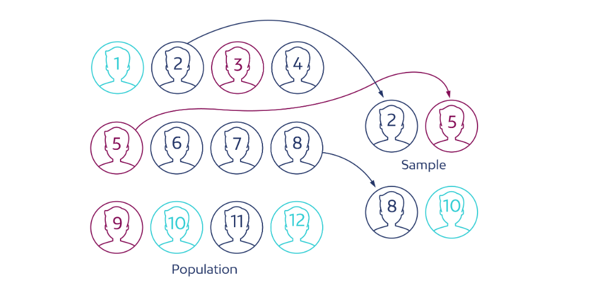
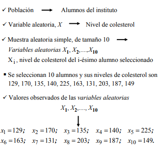
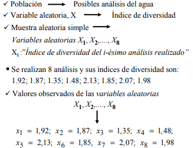

<link rel="stylesheet" href="styles.css" type="text/css">
<link rel="stylesheet" href="academicicons/css/academicons.min.css"/>

Cada elemento de la poblacion tiene la misma probabilidad de ser elegido para formar parte de la muestra y cada muestra del mismo tamano tiene la misma probabilidad de ser seleccionada.

# Muestra aleatoria simple de tamano n

Sea una poblacion donde observamos la variable aleatoria X.
Una muestra aleatoria simple, m.a.s., de tamano n, es un
conjunto de n variables aleatorias X1, X2, ...Xn, que verifican:

X1, X2, ...Xn son :

1. Independientes entre si
2. Cada Xi con identicas caracteristicas que X

a. El muestreo aleatorio simple en poblaciones finitas se realiza "con      reemplazamiento", es decir:

    Se selecciona un elemento de la poblacion al azar, se observa el     valor de la variable aleatoria X, se devuelve a la poblacion y se vuelve a seleccionar otro elemento. Asi hasta obtener los n elementos. Este procedimiento garantiza la independencia de las observaciones

    La seleccion aleatoria de los elementos se realiza con una tabla de numeros aleatorios, o con algun procedimiento informatico.

## Pasos de un muestreo

1. Poblacion en la que se observa la variable X
2. Se decide extraer una muestra aleatoria simple de tamano n, compuesta     por las variables aleatorias X1, X2,....,Xn
3. Se seleccionan n elementos de la poblacion -> **muestra**
4. Los elementos seleccionados generan n numeros

      x1, x2,....,xn, valores observados de
      las variables aleatorias X1, X2,...,Xn

## Ejemplo en poblaciones finitas

En un instituto se quiere realizar un estudio sobre el nivel de colesterol de los alumnos. Para ello, se decide extraer una muestra aleatoria simple de tamano 10.

    
## Ejemplo en poblaciones infinitas

Se analizan muestras de agua de un rio para estudiar el indice de diversidad de especies. Este indice se utiliza para medir el efecto de una perturbacion, como la contaminacion del agua, en seres vivos. Puede
determinarse la diversidad de la poblacion antes y despues de la perturbacion. Si el indice tras la perturbacion es mucho mas pequeno indica que la perturbacion ha tenido efectos negativos. Para esto, se decide extraer una muestra aleatoria simple de tamano 8

