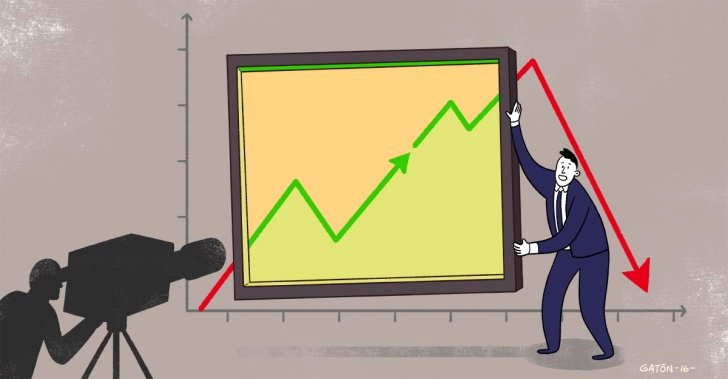
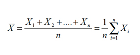

```{r setup, include=FALSE}
knitr::opts_chunk$set(echo = TRUE)
```

# Parametro
Un parametro estadistico es un numero que se obtiene a partir de los datos de una muestra estadistica. Los parametros estadisticos tambien se conocen como estadisticos descriptivos.
**sirven** para sintetizar o resumir la informacion dada por una tabla o por una grafica. En otras palabras, dados unos pocos parametros estadisticos se puede tener una idea general de la distribucion de la informacion.
**dan** un buen resumen cuando se conoce la distribucion de la poblacion. En particular, si la muestra proviene de una distribucion normal, entonces el promedio tipico y la desviacion estandar dan un buen resumen de la distribucion.

# Estadigrafos

## 1. Estadigrafos de orden
Son aquellos que dan informacion acerca del orden en la estructura de una muestra. Ya se han mencionado dos de ellos que aparecen en forma instantanea al ordenar la muestra: el maximo, X(n), y el minimo, X(1).

Se llama percentil a cada uno de los numeros que dividen la muestra en 100 partes iguales. En consecuencia, ellos son 99 y se denotan por P(k), donde k es el orden del percentil indicado. Dado el percentil P(k), este divide la muestra en dos partes, la inferior que contiene el k% inferior de las observaciones y la superior que contiene el (100-k%) de las observaciones; entre dos percentiles consecutivos esta contenido el 1% de la muestra. El siguiente esquema grafica las definiciones anteriores:

## 2. Estadigrafos de tendencia central
Cada vez que se observa un fenomeno cuantitativo, interesa saber si los datos recolectados se aglutinan en torno a ciertos valores representativos que son propios del fenomeno estudiado.

# Estadistica
La estadistica es fundamental para la investigacion, para el analisis de datos, con el fin de obtener resultados que sirvan como informacion para determinadas situaciones. Estos metodos estadisticos no se limitan, ya que los mismos pueden ser aplicados a cualquier campo que se desee estudiar. A pesar que la estadistica esta intimamente relacionada con la matematica tambien tiene su utilidad para el ambito social. Y en base a los estudios que se quieran realizar se debe hacer una diferenciacion entre los tipos de estadisticas.

# Asimetria
Es la falta de simetria entre los datos de una distribucion. refire a la curva que forman los valores de la serie presenta la misma forma a la izquierda y derecha de un valor central (media aritmetica).

# La Mediana
Es aquel valor que divide la muestra en dos partes iguales, como se dijo anteriormente. Debe notarse que la mediana es un estadigrafo de orden y tambien de centralizacion.

# La Media aritmetica o Promedio aritmetico
Es el estadigrafo de tendencia central mas conocido, usado y abusado. Para todos es sabido que dada una coleccion de datos X1, X2, ...., Xn, el promedio se define como la suma de los datos dividida por la cantidad de datos, y se denota por; en simbolos el promedio es:



# Rango o Recorrido
Se define el rango o recorrido de los datos como el maximo menos el minimo, lo que en simbolos se expresa asi:

**Rango = X(n) - X(1)**

# Desviacion Estandar
Para definir la desviacion estandar, previamente presentaremos lo que se llama desviacion de un dato respecto al promedio, que denotamos por "di":

**d = X1 - X**

# Hipotesis
Cualquier teoria que formule posibles lineas de trabajo experimental. Ver
hipotesis nula y alternativa.

# BIBLIOGRAFIAS     


*[https://www.inei.gob.pe/media/MenuRecursivo/publicaciones_digitales/Est/Lib0900/Libro.pdf]

*[http://www.dspace.uce.edu.ec/bitstream/25000/13720/3/Fundamentos%20B%C3%A1sicos%20de%20Estad%C3%ADstica-Libro.pdf]

*[http://intranet.comunidadandina.org/Documentos/Reuniones/DTrabajo/SG_REG_DIES_IV_dt%202.pdf]
