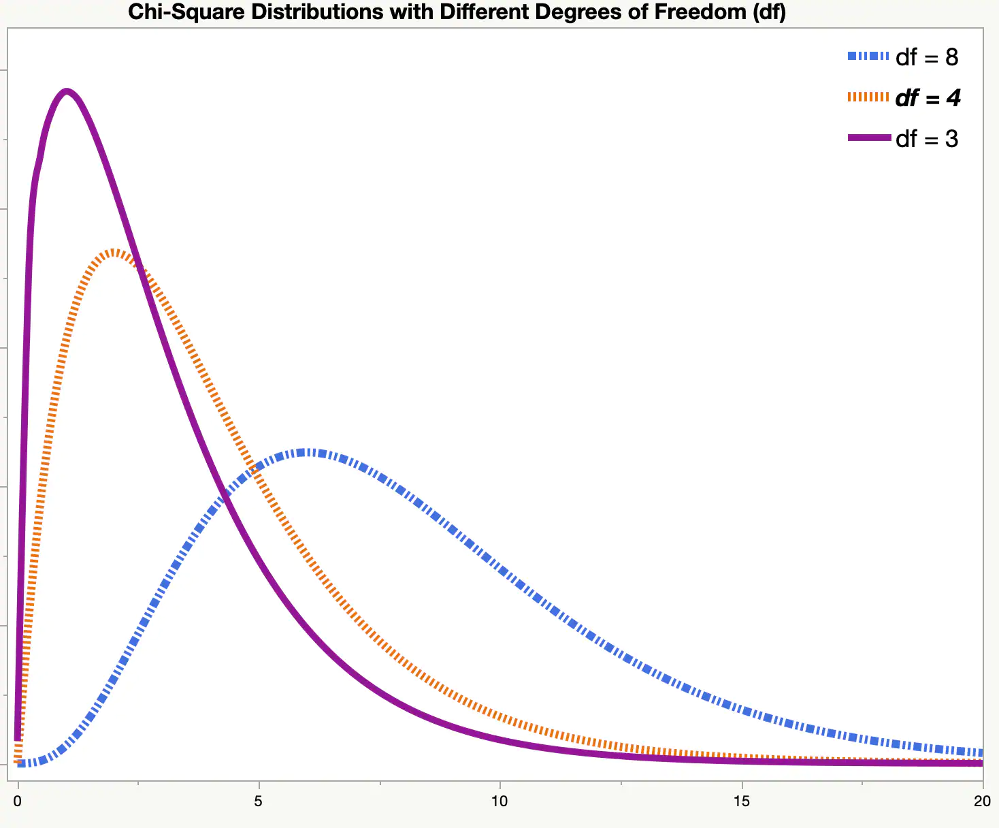
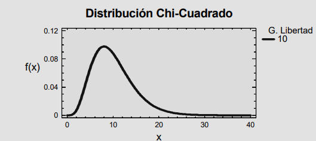
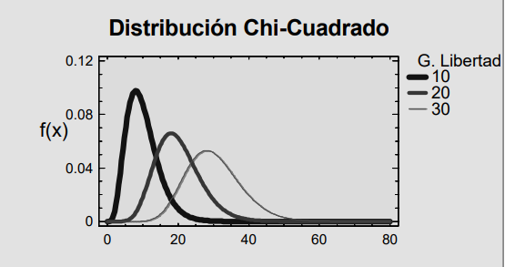

<link rel="stylesheet" href="styles.css" type="text/css">
<link rel="stylesheet" href="academicicons/css/academicons.min.css"/>

Sean n variables aleatorias, X1, X2,....Xn, que verifican:

    1. Independientes entre si
    2. Xi N ( 0; 1 )

Definimos la variable aleatoria X como:

    X = X + X + ... + Xn

Para valores grandes de n, la distribucion ChiCuadrado se aproxima a la distribucion Normal. La aproximacion se considera aceptable para n > 30

