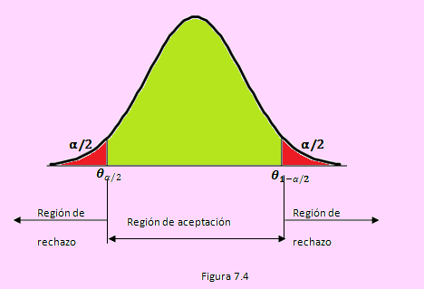
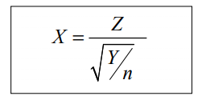
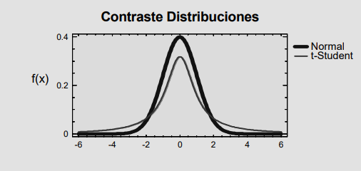
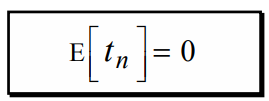
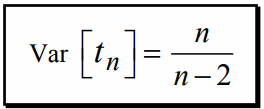
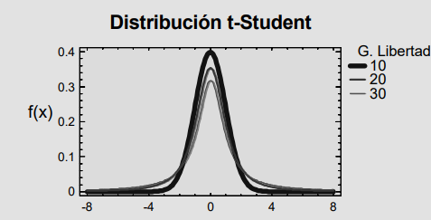

<link rel="stylesheet" href="styles.css" type="text/css">
<link rel="stylesheet" href="academicicons/css/academicons.min.css"/>

Sean las variables aleatorias, Y y Z, que verifican:

Independientes:

    Z--> N( 0; 1 )
    Y-->??n
    
Definimos la variable aleatoria X como:

La variable aleatoria X sigue una distribucion t de Student con n grados de libertad

Esperanza matematica

Varianza

Para valores grandes de n, la distribucion t de Student se aproxima a la distribucion Normal. La aproximacion se considera aceptable para n > 30

