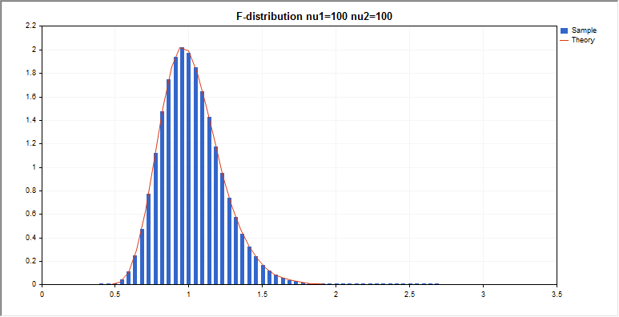
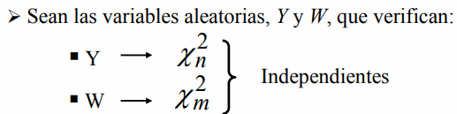
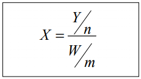
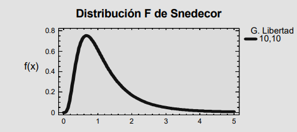

<link rel="stylesheet" href="styles.css" type="text/css">
<link rel="stylesheet" href="academicicons/css/academicons.min.css"/>

Definimos la variable aleatoria X como:

La variable aleatoria X sigue una distribucion F de Snedecor con n y m grados de libertad

Para valores grandes de n y m, la distribucion F de Snedecor se aproxima a la distribucion Normal.

