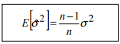

<link rel="stylesheet" href="styles.css" type="text/css">
<link rel="stylesheet" href="academicicons/css/academicons.min.css"/>

# Estadistico:

Una funcion de los valores de la muestra. Es una variable aleatoria, cuyos valores dependen de la muestra seleccionada. Su distribucion de
probabilidad, se conoce como **Distribucion muestral del estadistico**

Sea una poblacion donde se observa la variable aleatoria X. Esta variable X, tendra una distribucion de probabilidad, que puede ser conocida o desconocida, y ciertas caracteristicas o parametros poblacionales

Definimos los siguientes estadisticos muestrales:

Media muestral:

Varianza muestral:

Cuasi-Varianza muestral:

Consideramos todas las posibles muestras de tamano n

Su distribucion de probabilidad -->**Distribucion de la media muestral**

Esperanza matematica

Varianza

Los estadisticos muestrales, media, varianza y cuasivarianza verifican las siguientes propiedades:

Media muestral

Varianza muestral:

Cuasivarianza muestral

Estas propiedades se verifican siempre, cualquiera que sea la distribucion de la variable X

## Ejemplo en poblaciones infinitas

