# MEDIDAS DESCRIPTIVAS
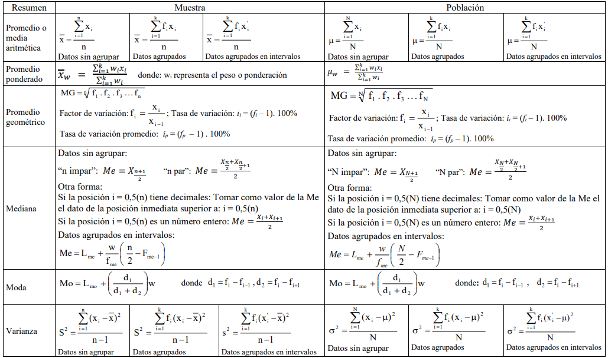
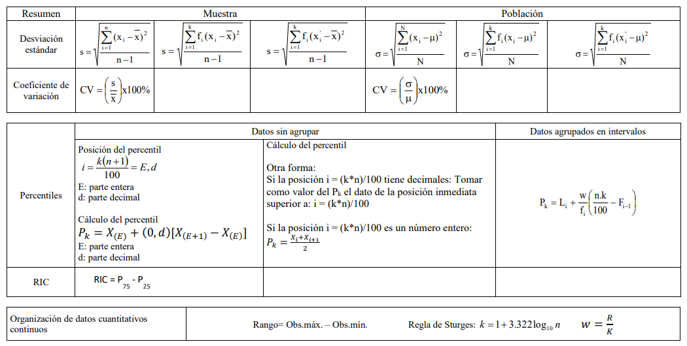

# DISTRIBUCIONES DE PROBABILIDAD

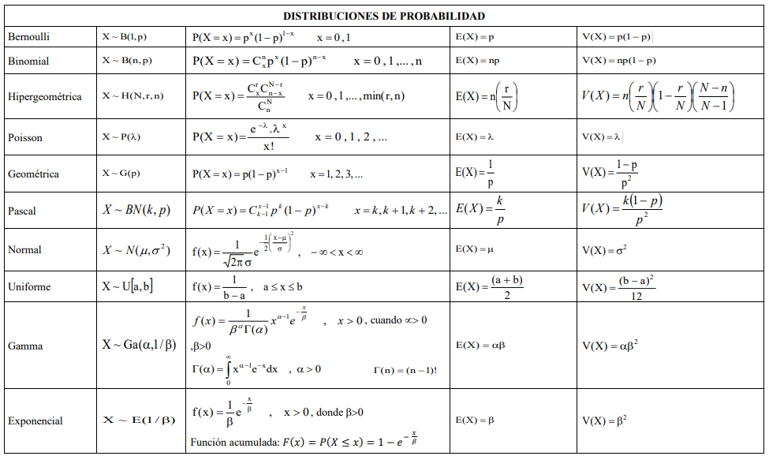

# ESTIMACION Y PRUEBA DE HIPOTESIS

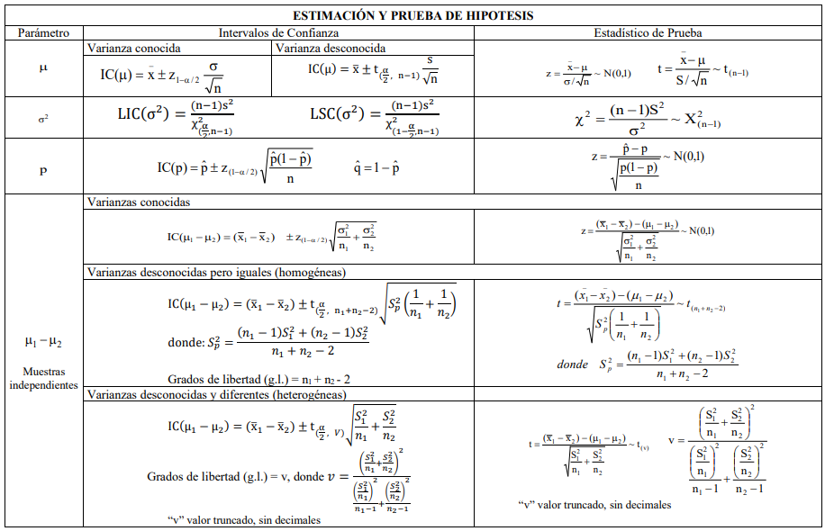
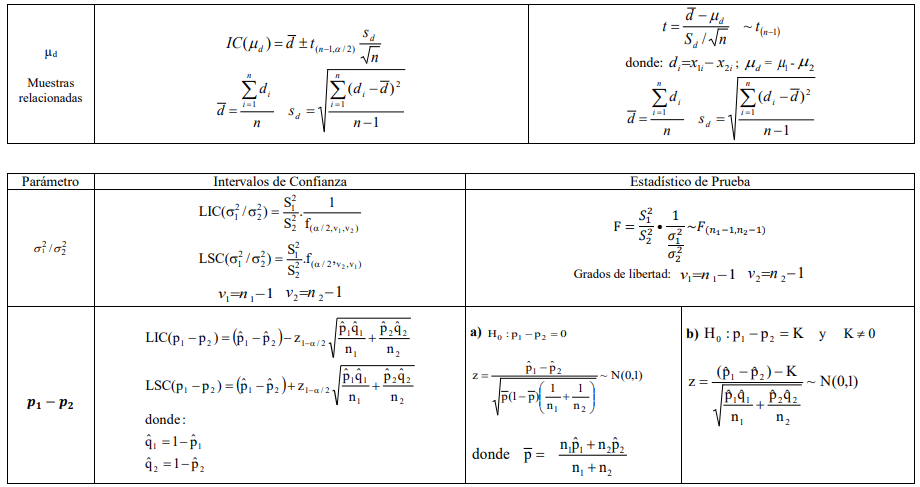
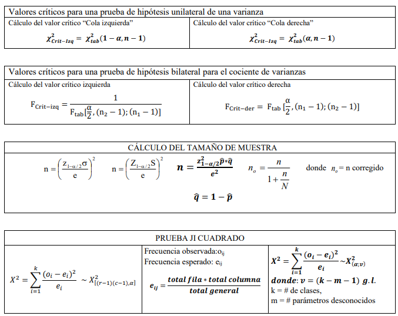

# ANALISIS DE REGRESION

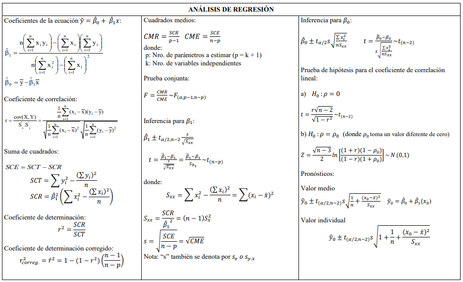

# ANALISIS DE REGRESION NO LINEAL

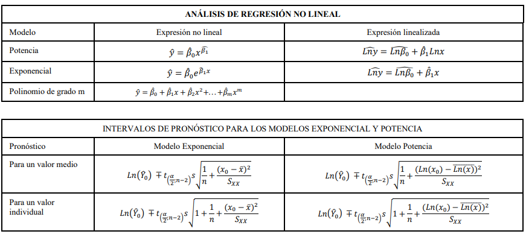

# DISENO DE UN FACTOR (DCA)

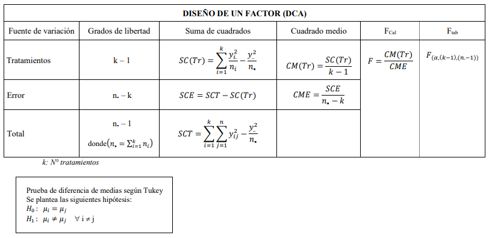

# DISENO DE BLOQUES AL AZAR (DBCA)

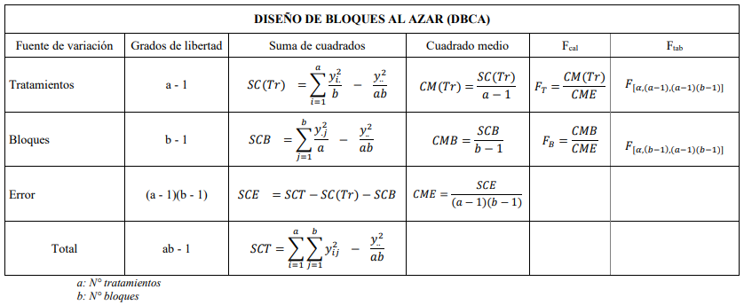

# DISENO FACTORIAL (AXB)

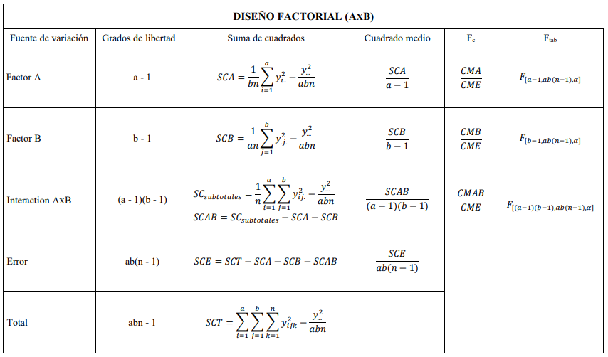

# SERIES DE TIEMPO

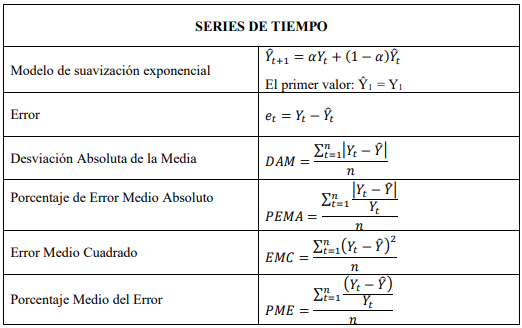

```{r setup, include=FALSE}
knitr::opts_chunk$set(echo = TRUE)
```

# TABLAS ESTADISTICAS

## TABLA DE NUMEROS ALEATORIOS

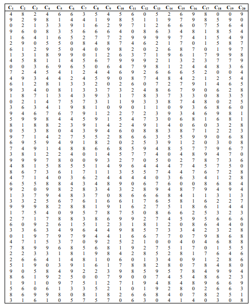

## TABLA DE LA DISTRIBUCION NORMAL ESTANDAR

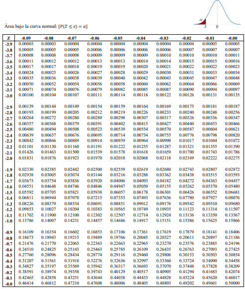

## TABLA DE LA DISTRIBUCION NORMAL

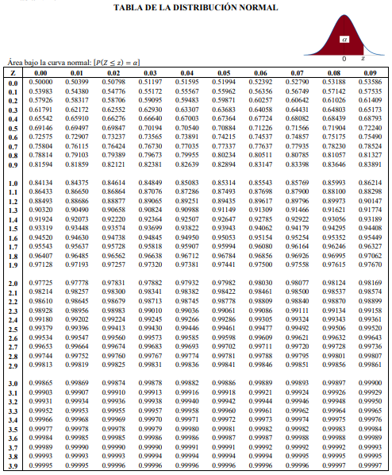

## TABLA DE LA DISTRIBUCION T-STUDENT

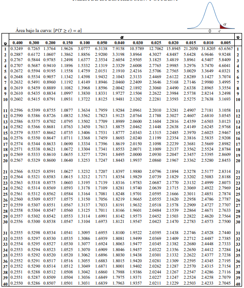


## TABLA DE LA DISTRIBUCION JI-CUADRADO

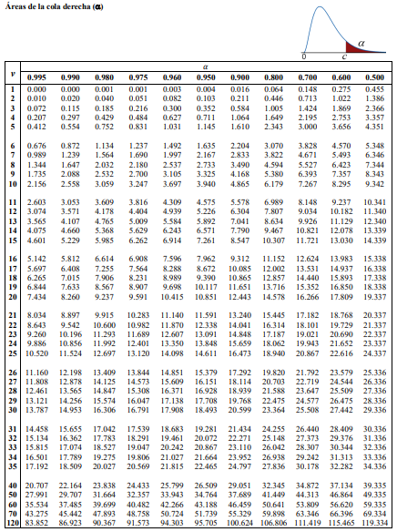
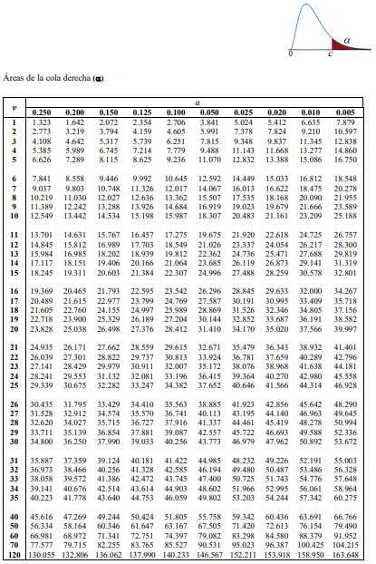

## TABLA DE LA DISTRIBUCION F

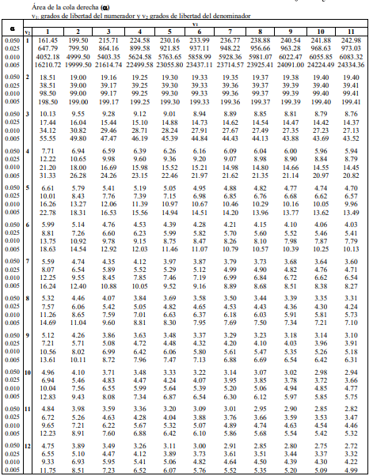
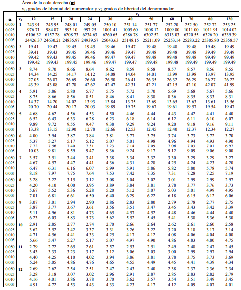
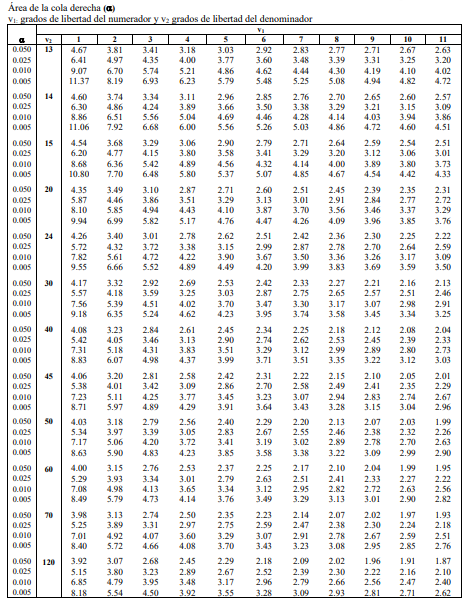
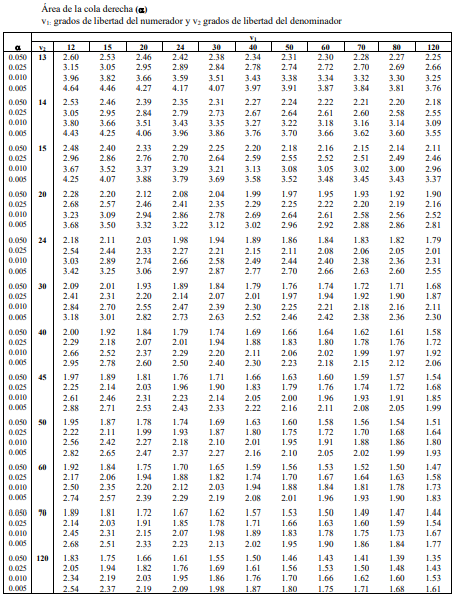

