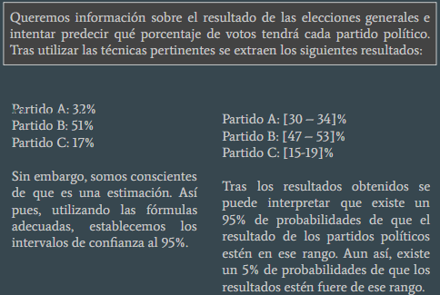

```{r setup, include=FALSE}
knitr::opts_chunk$set(echo = TRUE)
```

La inferencia estadistica es el conjunto de metodos que permiten inducir, a traves de una muestra estadistica, el comportamiento de una determinada poblacion. La inferencia estadistica, estudia entonces como, a traves de la aplicacion de dichos metodos sobre los datos de una muestra, se pueden extraer conclusiones sobre los parametros de la poblacion de datos. De la misma manera estudia tambien el grado de fiabilidad de los resultados extraidos del estudio.

Segun Berenson y Levine; Estadistica Inferencial son procedimientos estadisticos que sirven para deducir o inferir algo acerca de un conjunto de datos numericos (poblacion), seleccionando un grupo menor de ellos (muestra). El objetivo de la inferencia en investigacion cientifica y tecnologica radica en conocer clases numerosas de objetos, personas o eventos a partir de otras relativamente pequenas compuestas por los mismos elementos.

# Metodos de la inference estadistica
Los metodos y tecnicas de la inferencia estadistica se pueden dividir en dos: metodos de estimacion de parametros y metodos de contraste de hipotesis.

## Metodos de estimacion de parametros
Se encarga de asignar un valor al parametro o al conjunto de parametros que caracterizan el campo sujeto a estudio. Claro que al ser una estimacion existe cierto error. Para obtener estimaciones adaptadas a esa realidad, se crean intervalos de confianza.
[https://www.youtube.com/watch?v=aXsaleNwKFI&ab_channel=OrlandoToscano]

### Ejemplo



## Metodos de contraste de hipotesis
Su objetivo es comprobar si una estimacion corresponde con los valores poblacionales. En todo contraste de hipotesis existen dos supuestos. La hipotesis nula (H0) que recoge la idea de que un valor tiene un valor predeterminado. Si se rechaza la hipotesis nula (H0), entonces se acepta la hipotesis alternativa (H1).

<figure>
<video width=770px controls>
  <source src="imagenes/ContrasteHipotesis_ basicos.webm" type="video/webm">
</video>
</figure>


